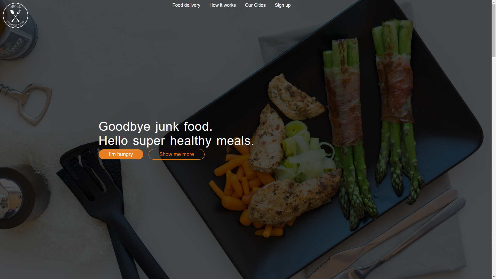
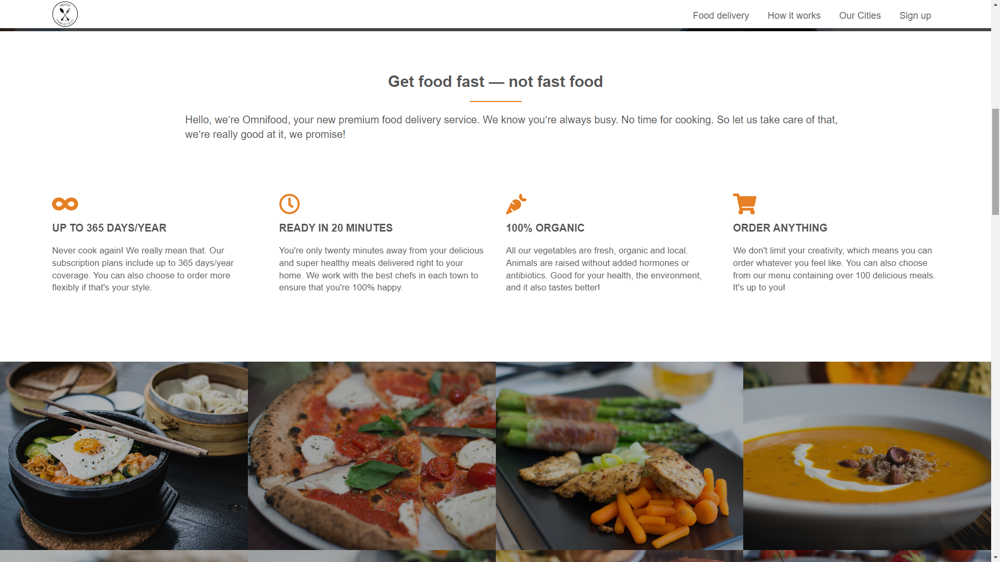
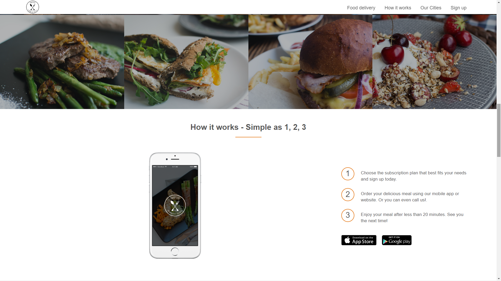
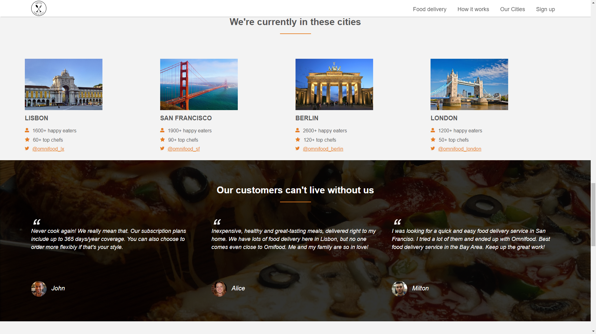
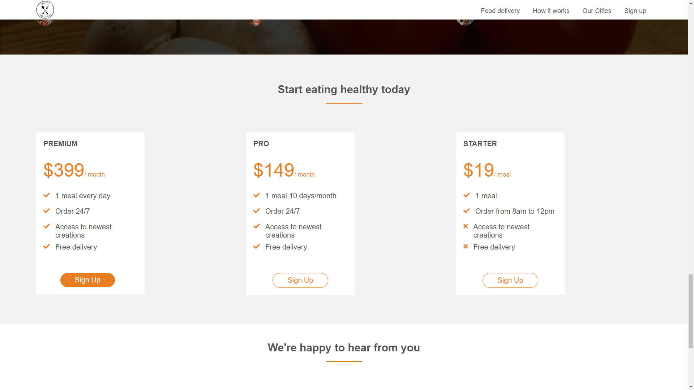
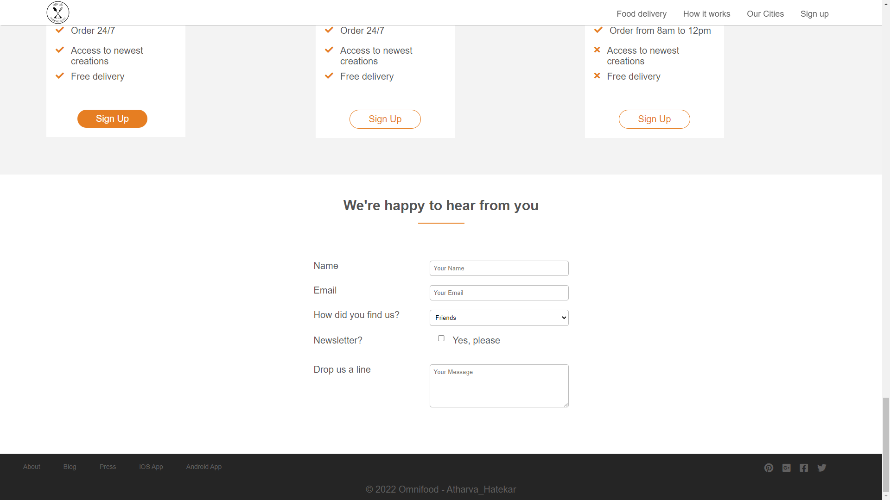

 <b>Food-Ordering-Website 

___

<b>Designed a responsive real-world website using HTML-5, CSS-3 and jQuery. It is designed to be used smoothly on desktops, iPad and smartphones.
  

 <b>Screenshots: 

  

  

  

  

  

